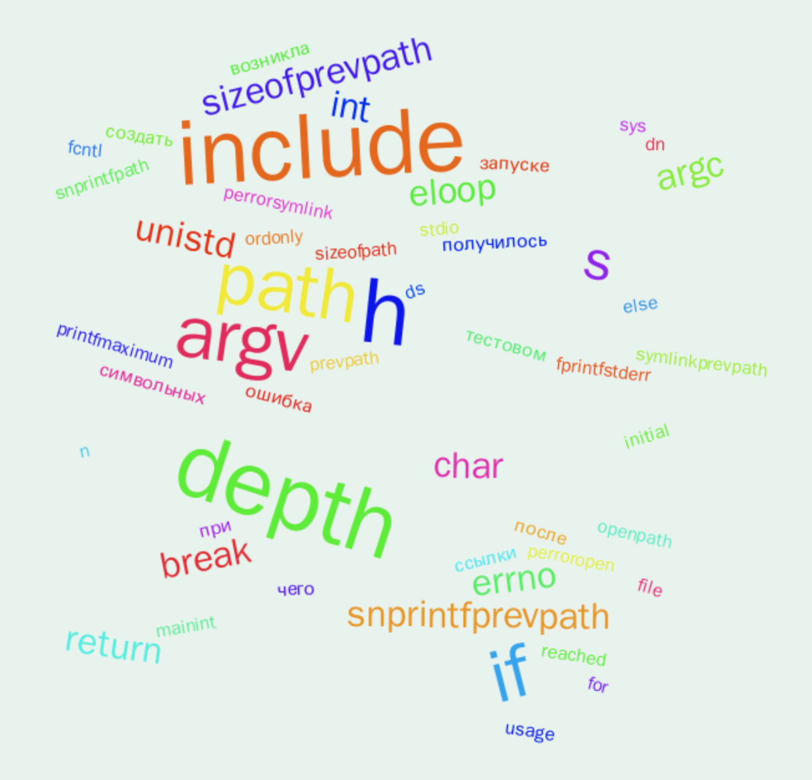

# plagiarism-checker

## Запуск

Приложение запускается с помощью Docker Compose. Для этого необходимо выполнить команду:

```bash
docker compose --profile prod up
```

Переменные окружения можно задать в файлах `.env*` (файлы с значениями по умолчанию можно найти в корне каждого сервиса).

## Ручное тестирование

Поднят Swagger UI на `/swagger/index.html`, также можно получить OpenAPI спецификацию по адресу `/swagger.yaml`.

### Что можно попробовать

1. Выгрузить файл в `storage`.
2. Скачать выгруженный файл из `storage`, проверив, что он соответствует исходному.
3. Отправить файл на проверку:
   1. `single` режим — проверка одного файла: статистика по файлу, список полностью совпадающих файлов (плагиат 100%).
   2. `diff` режим — проверка двух файлов: сравнение двух файлов на схожесть, возвращает "схожесть" двух файлов (коэффициент от 0 до 1). Под капотом используется алгоритм из знакомой всем утилиты `diff`.
4. После `single` проверки становится доступна возможность построить облако слов по файлу.

Пример того, как выглядит облако слов на произвольной программе на языке `C`:



## test coverage

Написаны тесты для бизнес-логики каждого микросервиса, интеграционные тесты для `storage` и `analysis` не проводились.

```bash
$ go test -cover ./storage/internal/application/... -race
ok      github.com/maklybae/plagiarism-checker/storage/internal/application     1.188s  coverage: 90.7% of statements
        github.com/maklybae/plagiarism-checker/storage/internal/application/mocks               coverage: 0.0% of statements
```

